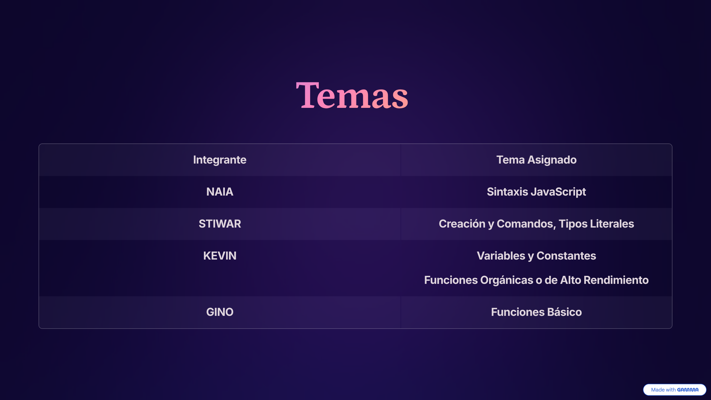

# 🚀 Funciones en JavaScript - Grupo A

## 🌟 Descripción

Proyecto educativo interactivo desarrollado por el **Grupo A** como parte del curso Full Stack. Esta aplicación web proporciona una guía completa y visual sobre los conceptos fundamentales de JavaScript, incluyendo sintaxis, variables, constantes y funciones.

El proyecto presenta una interfaz moderna y dinámica con un diseño glassmorphism, animaciones suaves y una experiencia de usuario intuitiva para facilitar el aprendizaje de JavaScript desde los conceptos básicos hasta las funciones orgánicas avanzadas.

---

## 🧭 Tabla de Contenidos

- [Descripción](#-descripción)
- [Instalación](#-instalación)
- [Uso](#️-uso)
- [Configuración](#️-configuración)
- [Ejecución de Pruebas](#-ejecución-de-pruebas)
- [Tecnologías Utilizadas](#-tecnologías-utilizadas)
- [Estructura del Proyecto](#-estructura-del-proyecto)
- [Contenido Educativo](#-contenido-educativo)
- [Licencia](#-licencia)
- [Contacto / Reconocimientos](#-contacto--reconocimientos)

---

## 🚀 Instalación

### Prerrequisitos

- **Node.js** (versión 14 o superior)
- **npm** (viene incluido con Node.js)
- Un navegador web moderno (Chrome, Firefox, Safari, Edge)

### Pasos de Instalación

1. **Clonar el repositorio**
   ```bash
   git clone https://github.com/Kruiztwntyfive/funciones-Javascript.git
   cd funciones-Javascript
   ```

2. **Instalar dependencias**
   ```bash
   npm install
   ```

3. **¡Listo!** El proyecto está configurado y listo para usar.

---

## ▶️ Uso

### Ejecución Local

Para visualizar el proyecto en tu navegador local:

1. **Opción 1: Abrir directamente**
   - Navega hasta la carpeta del proyecto
   - Abre el archivo `index.html` en tu navegador web

2. **Opción 2: Usar un servidor local (Recomendado)**
   ```bash
   # Si tienes Python 3 instalado
   python -m http.server 8000
   
   # O si tienes Node.js con http-server
   npx http-server -p 8000
   ```
   Luego abre tu navegador en `http://localhost:8000`

3. **Opción 3: Usar Live Server (VS Code)**
   - Instala la extensión "Live Server" en VS Code
   - Click derecho en `index.html` → "Open with Live Server"

### Navegación

- **Menú de Navegación**: Utiliza la barra superior para navegar entre las diferentes secciones
- **Secciones Expandibles**: Haz clic en los títulos de las secciones para expandir/contraer el contenido
- **Botón Scroll**: Usa el botón flotante en la esquina inferior derecha para volver al inicio rápidamente

---

## ⚙️ Configuración

### Personalización del Proyecto

#### Modificar Estilos
Los estilos principales se encuentran en:
```
assets/css/main.css
```

#### Modificar Scripts
Los scripts JavaScript están organizados en:
```
assets/js/
├── main.js          # Script principal
├── navbar.js        # Funcionalidad del menú de navegación
└── btn-scroll.js    # Botón de scroll to top
```

#### Agregar Nuevas Secciones
Para añadir contenido educativo, edita el archivo `index.html` siguiendo la estructura de las secciones existentes.

---

## ✅ Ejecución de Pruebas

### Pruebas Manuales

Actualmente el proyecto utiliza pruebas manuales. Para verificar el correcto funcionamiento:

1. **Prueba de Navegación**
   - Verifica que todos los enlaces del menú funcionen correctamente
   - Comprueba que las secciones expandibles se abran y cierren

2. **Prueba de Responsividad**
   - Abre las herramientas de desarrollo (F12)
   - Prueba diferentes tamaños de pantalla
   - Verifica que el diseño se adapte correctamente

3. **Prueba de Scripts**
   - Abre la consola del navegador (F12 → Console)
   - Verifica que no haya errores de JavaScript
   - Prueba la funcionalidad del botón "Volver arriba"

### Validación de Código

```bash
# Para validar TypeScript (si trabajas con archivos .ts)
npx tsc --noEmit
```

---

## 💻 Tecnologías Utilizadas

### Frontend
- **HTML5** - Estructura semántica del contenido
- **CSS3** - Estilos y animaciones
  - Glassmorphism
  - Flexbox & Grid
  - Animaciones CSS
  - Variables CSS personalizadas
- **JavaScript (ES6+)** - Interactividad y lógica
  - Manipulación del DOM
  - Event Listeners
  - Funciones modernas

### Herramientas de Desarrollo
- **TypeScript** (v5.9.3) - Superset de JavaScript con tipado estático
- **Git** - Control de versiones
- **npm** - Gestor de paquetes

### Recursos Multimedia
- Video de fondo para experiencia visual mejorada
- Diseño responsive para todos los dispositivos

---

## 📁 Estructura del Proyecto

```
funciones-Javascript/
├── assets/
│   ├── css/
│   │   └── main.css              # Estilos principales
│   ├── img/                      # Imágenes y recursos visuales
│   └── js/
│       ├── main.js               # Script principal
│       ├── navbar.js             # Navegación
│       └── btn-scroll.js         # Scroll to top
├── funciones-organicas/          # Ejemplos de funciones orgánicas
├── sintaxisjs/                   # Ejemplos de sintaxis JS
├── ts/                           # Archivos TypeScript
├── variables/                    # Ejemplos de variables
├── variables-constantes/         # Ejemplos de constantes
├── index.html                    # Página principal
├── package.json                  # Dependencias del proyecto
└── README.md                     # Este archivo
```

---

## 📚 Contenido Educativo

El proyecto cubre los siguientes temas de JavaScript:

### 1. **Sintaxis JavaScript**
- Ubicación del código (etiquetas script, archivos .js)
- Modo estricto ("use strict")
- Zonas principales de una webpage

### 2. **Variables y Constantes**
- Tipado dinámico vs tipado fijo
- TypeScript
- Scope (ámbito global y local)
- Declaración con `let`, `const`, `var`
- Tipos literales: Integer, Float, String, Boolean, Undefined, Null

### 3. **Funciones Básicas**
- Declaración e invocación
- Funciones anónimas vs nominativas
- Parámetros y argumentos
- Return
- Funciones flecha (Arrow Functions)
- Parámetros REST
- Operador SPREAD

### 4. **Funciones Orgánicas**
- forEach
- map
- filter

---

## 📜 Licencia

Este proyecto es de código abierto y está disponible bajo la **Licencia MIT**.

```
MIT License

Copyright (c) 2025 Grupo A - Funciones JavaScript

Permission is hereby granted, free of charge, to any person obtaining a copy
of this software and associated documentation files (the "Software"), to deal
in the Software without restriction, including without limitation the rights
to use, copy, modify, merge, publish, distribute, sublicense, and/or sell
copies of the Software, and to permit persons to whom the Software is
furnished to do so, subject to the following conditions:

The above copyright notice and this permission notice shall be included in all
copies or substantial portions of the Software.

THE SOFTWARE IS PROVIDED "AS IS", WITHOUT WARRANTY OF ANY KIND, EXPRESS OR
IMPLIED, INCLUDING BUT NOT LIMITED TO THE WARRANTIES OF MERCHANTABILITY,
FITNESS FOR A PARTICULAR PURPOSE AND NONINFRINGEMENT. IN NO EVENT SHALL THE
AUTHORS OR COPYRIGHT HOLDERS BE LIABLE FOR ANY CLAIM, DAMAGES OR OTHER
LIABILITY, WHETHER IN AN ACTION OF CONTRACT, TORT OR OTHERWISE, ARISING FROM,
OUT OF OR IN CONNECTION WITH THE SOFTWARE OR THE USE OR OTHER DEALINGS IN THE
SOFTWARE.
```

---

## 📧 Contacto / Reconocimientos

### 👥 Equipo de Desarrollo - Grupo A

Este proyecto fue desarrollado con dedicación por:

- **Stiwar Troyano** - Desarrollo y diseño
- **Junior Gino** - Desarrollo y contenido
- **Kevin Ruiz** - Desarrollo y testing
- **Naia Arenaza** - Desarrollo y Contenido

### 🎓 Contexto Académico

Proyecto desarrollado como parte del **Curso Full Stack PeñascalF5** en el taller de HTML y CSS.

### 🙏 Agradecimientos

- A nuestros instructores por la guía y el apoyo
- A la comunidad de desarrolladores por los recursos educativos
- A todos los que contribuyen al aprendizaje de JavaScript

### 📬 Contacto

Para preguntas, sugerencias o colaboraciones:

- **Repositorio**: [github.com/Kruiztwntyfive/funciones-Javascript](https://github.com/Kruiztwntyfive/funciones-Javascript)
- **Issues**: Reporta bugs o solicita features en la sección de Issues del repositorio

---

<div align="center">

**⭐ Si este proyecto te fue útil, no olvides darle una estrella ⭐**

Hecho con ❤️ por el Grupo A

</div>
